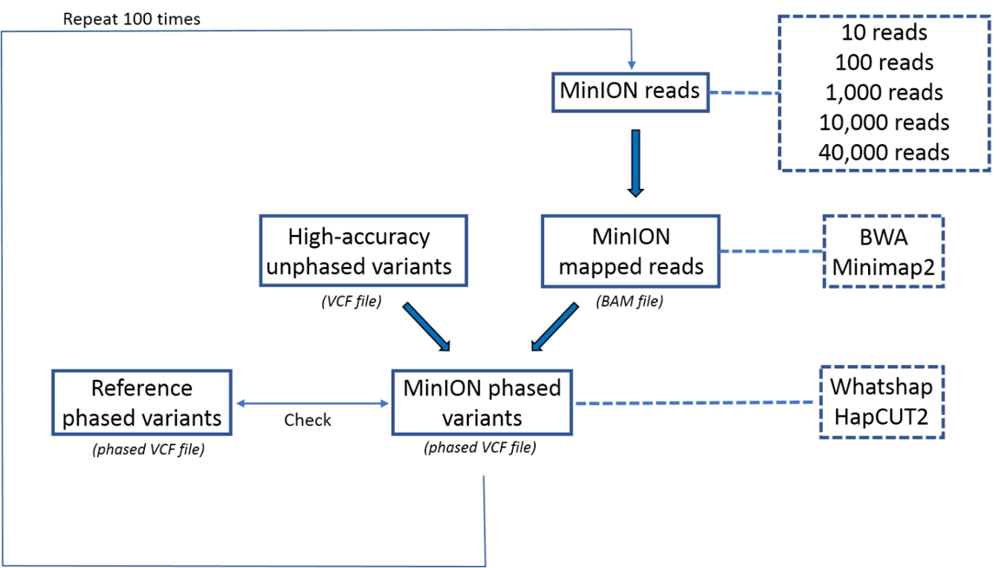
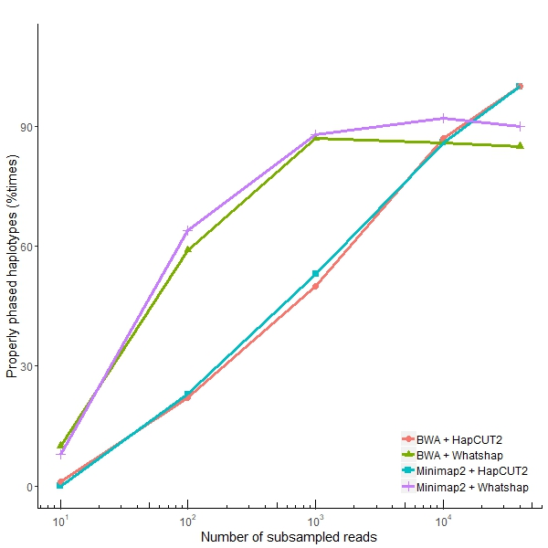
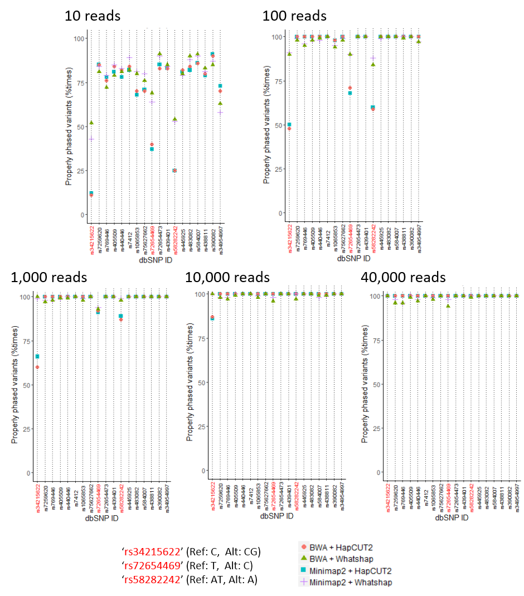

# ONToHap

**ONToHap** is a ONT-based pipeline for performing haplotype phasing and for evaluating haplotype phasing accuracy, supporting multiple aligners and phasers. It currently supports aligners _BWA_ and _Minimap2_, and phasers _WhatsHap_, _Hapchat_ and _HapCUT2_.

## Getting started

**Prerequisites**

* Miniconda3.
Tested with conda 4.6.14.
```which conda``` should return the path to the executable.
If you don't have Miniconda3 installed, you could download and install it with:
```
wget https://repo.anaconda.com/miniconda/Miniconda3-latest-Linux-x86_64.sh
chmod 755 Miniconda3-latest-Linux-x86_64.sh
./Miniconda3-latest-Linux-x86_64.sh
```

**Installation**

```
git clone https://github.com/MaestSi/ONToHap.git
cd ONToHap
chmod 755 *
./install.sh
```

A conda environment named _ONToHap_env_ is created, where seqtk, minimap2, bwa, whatshap, samtools and R are installed. Moreover, HapCUT2 is installed to the _ONToHap_ directory and the executables are linked to the _ONToHap_env_ bin directory.
Then, you can open the **config_ONToHap.R** file with a text editor and set the variables _PIPELINE_DIR_ and _SEQTK_ to the value suggested by the installation step.

## Accuracy test overview

<p align="center">
  
</p>

## Usage

The ONToHap pipeline can be used either to phase variants stored in a VCF file using ONT long reads or to evaluate the accuracy of variant phasing tools, comparing the obtained results with a ground-truth phase. In both cases, the first step of the pipeline requires you to open the _config_ONToHap.R_ file with a text editor and to modify it according to your preferences.

**Launch_ONToHap.sh**

Usage:
Launch_ONToHap.sh -f \<fastq_reads\> -u \<unphased_vcf\> -r \<reference_fasta\> -o \<output_dir\>

Inputs:
* \<fastq reads\>: fastq file containing ONT reads for one sample
* \<unphased_vcf\>: VCF file storing variants to be phased
* \<reference_fasta\>: fasta file containing the sequence corresponding to the region under study
* \<output_dir\>: output directory where results are going to be stored

Outputs:
* \<sample_name>\_ONToHap_results: folder containing file _consensus_haplotype.vcf_ storing phased variants and folders with reads subsampled at each iteration and corresponding VCF files

**Launch_ONToHap_accuracy_test.sh**

Usage:
Launch_ONToHap_accuracy_test.sh -f \<fastq_reads\> -u \<unphased_vcf\> -p \<ground_truth_phased_vcf\> -r \<reference_fasta\> -o \<output_dir\>

Inputs:
* \<fastq reads\>: fastq file containing ONT reads for one sample
* \<unphased_vcf\>: VCF file storing variants to be phased
* \<ground_truth_phased_vcf>: VCF file storing ground-truth phased variants, used for evaluating accuracy of ONT-based phasing
* \<reference_fasta\>: fasta file containing the sequence corresponding to the region under study
* \<output_dir\>: output directory where results are going to be stored

Outputs:
* \<sample_name>\_ONToHap_results: folder containing file _Report\_\<aligner\>\_\<phaser\>\_\<num_reads\>\_reads\_\<num\_iterations\>\_iterations_ storing phasing accuracy and folders with reads subsampled at each iteration and corresponding VCF files

## Plotting results

After running **Launch_ONToHap_accuracy_test.sh**, you may be interested in plotting phasing accuracy results. For this purpose, you may use **Plot_phasing_accuracy_tests.R** script as a starting point. This is how the accuracy of reconstructing the full haplotype for different number of input reads may look like.

<p align="center">
  
</p>

If you are also interested in understanding which are the most problematic variants to be phased, you may want to plot the phasing accuracy split by variant too.

<p align="center">
  
</p>


